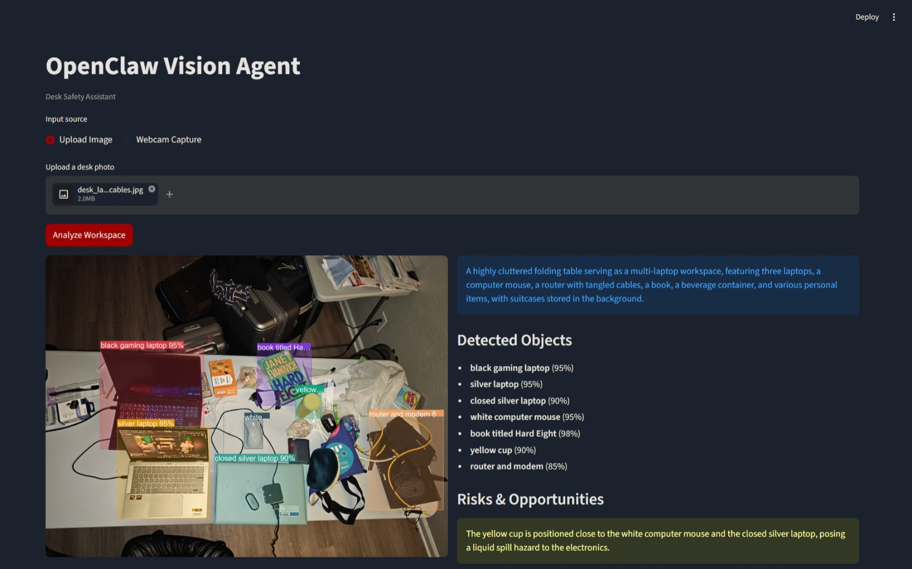
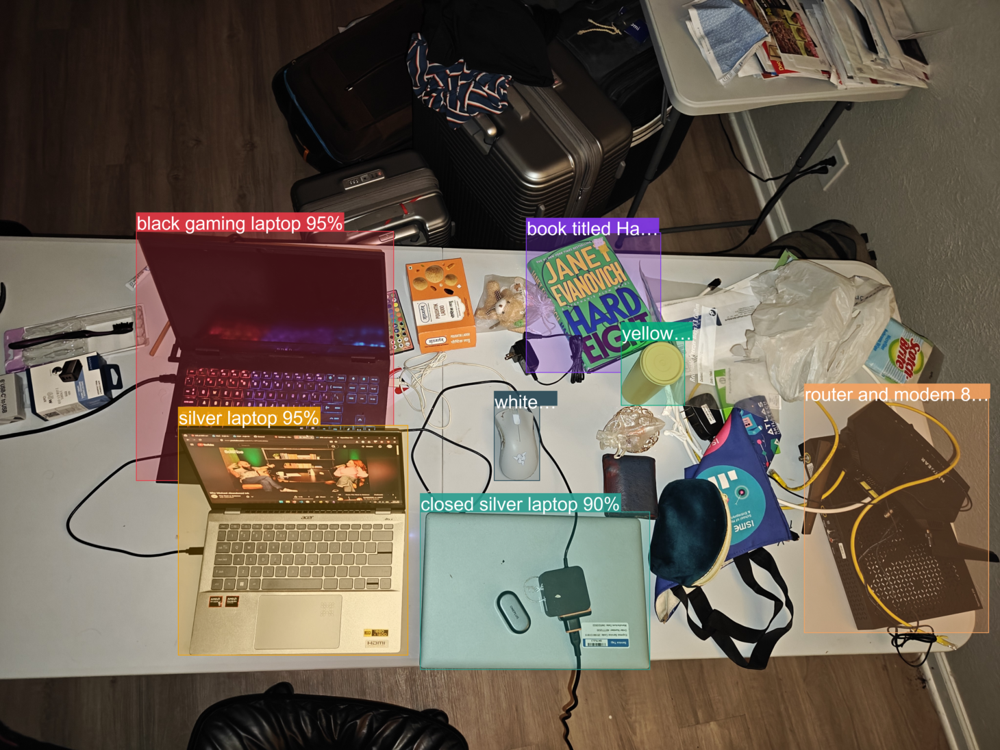
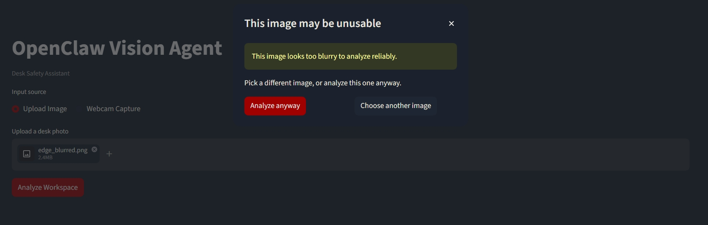

# OpenClaw Vision Agent

**Give OpenClaw eyes.** A prototype vision agent that analyzes workspace images, identifies objects and safety risks, and suggests practical actions — built as a Desk Safety Assistant demo.

Built for [LVL3.ai](https://lvl3.ai) / Claw.dius Maximus — Level 3 automation that understands objectives and adapts intelligently.

> **Note on model choice:** The assignment suggested OpenAI `gpt-4o`. I used Google **Gemini 3.5 Flash** instead — a deliberate deviation for its generous free tier (this is an unfunded prototype), native spatial grounding for bounding boxes without a separate detector, and first-class structured outputs driven directly by a Pydantic schema. The pipeline is model-agnostic in shape; only `core/vision.py` would change to swap providers.

## Quick Start

```bash
git clone https://github.com/xpw1337/openclaw-vision-agent.git
cd openclaw-vision-agent
pip install -r requirements.txt
```

Create a `.env` file with your Gemini API key:

```
GEMINI_API_KEY=your-api-key-here
```

Run the app:

```bash
streamlit run app.py
```

Optionally, run the test suite (41 tests):

```bash
python -m pytest
```

## Multi-Agent Infrastructure (Week 1)

The repo also includes a headless **NATS-driven agent worker** deployed on a local k3d cluster (3 replicas + NATS message bus). This wraps the same `core/` vision pipeline for the multi-camera surveillance roadmap.

- **Plan:** [docs/week1-infrastructure-foundation.md](docs/week1-infrastructure-foundation.md)
- **Setup guide:** [docs/week1-setup.md](docs/week1-setup.md)
- **5-week roadmap:** [multi-agent-visual-intelligence-5-week-plan.md](multi-agent-visual-intelligence-5-week-plan.md)

Quick start (after Docker + k3d are installed):

```powershell
powershell -ExecutionPolicy Bypass -File scripts\setup-cluster.ps1
powershell -ExecutionPolicy Bypass -File scripts\build-and-deploy.ps1
```

## What It Does

1. **Upload** a photo of your desk/workspace (or capture via webcam)
2. **Analyze** — the image is sent to Google's Gemini 3.5 Flash with a structured prompt
3. **Results** — structured JSON output with:
   - Scene summary
   - Detected objects with confidence scores
   - Safety risks and opportunities
   - Practical suggested actions
   - Honest confidence notes
4. **Annotated image** — original image overlaid with object labels, bounding boxes (when available), and a visual legend

## Architecture

```
Image Input (upload / webcam)
  → Validation (format, size)
  → Base64 Encoding (JPEG, max 2048px)
  → Gemini 3.5 Flash (structured output via Pydantic schema)
  → Pydantic Validation (with fallback parser)
  → Pillow Annotation (bounding boxes + legend overlay)
  → Streamlit Display (two-column: annotated image | structured results)
```

### Component Responsibilities

| Module | File | Role |
|--------|------|------|
| Vision | `core/vision.py` | Pydantic models, image encoding, Gemini API call, system prompt |
| Parser | `core/parser.py` | Fallback JSON parsing, markdown fence stripping, dict conversion |
| Annotator | `core/annotator.py` | Pillow-based image annotation — bounding boxes + text legend |
| App | `app.py` | Streamlit UI — input handling, layout, display, error states |

## Project Structure

```
openclaw-vision-agent/
├── app.py                    # Streamlit UI, error matrix, session state
├── core/
│   ├── __init__.py           # Public exports
│   ├── vision.py             # Pydantic schema, Gemini call, bbox normalization
│   ├── parser.py             # Fallback JSON parsing
│   ├── annotator.py          # Pillow annotation (bbox + legend)
│   └── quality.py            # Blank / blurry pre-check
├── tests/                    # 41 unit tests (annotator, parser, quality, vision)
├── sample_inputs/            # Demo desk photos + edge-case fixtures
├── sample_outputs/           # Real captured JSON for the desk photos
├── assets/                   # Demo screenshots
├── docs/
│   ├── architecture.md       # Pipeline diagram + design rationale
│   ├── week1-infrastructure-foundation.md  # Week 1 plan (implemented)
│   └── week1-setup.md        # Reproduce k3d/NATS/agent deployment
├── requirements.txt
├── .env.example
├── .gitignore
├── README.md
├── PRD.md                    # Build plan / spec
└── PRODUCT_ROADMAP.md        # 4-iteration delivery plan
```

## Example Output

```json
{
  "scene_summary": "A desk with a laptop, notebook, coffee cup, cables, and paper receipts.",
  "objects": [
    {"label": "laptop", "confidence": 0.94},
    {"label": "coffee cup", "confidence": 0.87},
    {"label": "cables", "confidence": 0.72}
  ],
  "risks_or_opportunities": [
    "Liquid is close to electronics.",
    "Cables may create clutter or snag risk."
  ],
  "suggested_actions": [
    "Move the coffee cup away from the laptop.",
    "Bundle or reroute visible cables.",
    "Scan the receipts if they need reimbursement."
  ],
  "confidence_notes": "Object labels are estimates. Do not rely on this alone for safety-critical decisions."
}
```

## Tech Stack

| Technology | Why |
|------------|-----|
| **Streamlit** | Fast to prototype, built-in file upload and webcam capture, clean demo UI |
| **Google Gemini 3.5 Flash** | Strong multimodal reasoning at low cost, native spatial grounding for bounding boxes, structured outputs via Pydantic schema, generous free tier |
| **Pillow (PIL)** | Lightweight image annotation — no heavy OpenCV dependency for simple overlays |
| **Pydantic** | Type-safe schema definition, automatic JSON schema generation for structured outputs |
| **python-dotenv** | Clean environment variable management, keeps secrets out of code |

## Status

### Fully Working
- **Two input sources** — file upload (`jpg/jpeg/png/webp`) and live webcam capture, sharing one downstream pipeline.
- **Robust preprocessing** — EXIF orientation correction (upright phone photos), RGBA/palette/grayscale → RGB normalization, resize to ≤2048px.
- **Structured output** — Gemini 3.5 Flash constrained to a Pydantic schema; typed `VisionAnalysis` every time.
- **Fallback parser** — recovers a valid result from raw model text (markdown-fence stripping, default-filling) when the SDK can't.
- **Annotator, two modes** — semi-transparent bounding boxes with collision-aware, truncated labels; automatic legend-panel fallback when no usable boxes exist.
- **Image quality guard** — flags blank/blurry photos before spending an API call, with an "analyze anyway" override.
- **Full error matrix** (PRD §5) — missing key, corrupt file, tiny image, API/network failure, content-safety block, malformed JSON — all surface as friendly states, never raw tracebacks.
- **Two-column results UI** — annotated image alongside scene summary, objects, risks, actions, confidence notes, and a raw-JSON expander; results persist across Streamlit reruns.
- **41 passing unit tests** across annotator, parser, quality, and vision.

### Partial
- **Bounding boxes**: Gemini returns approximate normalized coordinates, not pixel-accurate detection. Boxes are drawn when available but may be inaccurate.
- **Quality thresholds**: the blank/blurry heuristics are tuned on the sample desk photos — sensible defaults, not a calibrated classifier. They warn rather than block, and can be overridden.

### Would Improve With More Time
- Multiple analysis modes (whiteboard, receipt, inventory, site safety)
- Analysis history and comparison across frames
- OCR pipeline for text extraction
- Evaluation set with expected outputs
- OpenClaw action envelope format for downstream agent consumption
- Edge deployment documentation (Raspberry Pi / Jetson Nano)

## Assumptions & Limitations

- **Bounding boxes are model estimates**, not the output of a dedicated object detector (like YOLO). They may be inaccurate or missing entirely.
- **Confidence scores are the model's self-assessment**, not calibrated probabilities. They indicate relative certainty, not ground truth.
- **Not for safety-critical decisions.** This is a prototype demo — do not rely on it for actual workplace safety compliance.
- **Single image analysis only** — no video, multi-frame, or streaming support.
- **Webcam capture requires HTTPS** in production deployments (localhost works for local development).
- **API dependency** — requires an active Gemini API key and internet connection. Latency depends on image size and API load (typically 2-6 seconds on Flash).

## Demo Evidence

**Sample inputs** live in [`sample_inputs/`](sample_inputs/) — two real desk photos
(`desk_laptops_cables.jpg`, `desk_cluttered.jpg`) plus edge-case fixtures for the
quality guard (`edge_blurred.png`, `edge_blank_black.png`, `edge_blank_white.png`).

**Sample outputs** in [`sample_outputs/`](sample_outputs/) are the *actual* JSON the
app produced for those two photos (not hand-written), so you can see the schema
without running anything.

### Screenshots

| | |
|---|---|
| Full app, post-analysis |  |
| Annotated image (close-up) |  |
| Error / warning state |  |

## License

Built as a take-home assignment for LVL3.ai.
