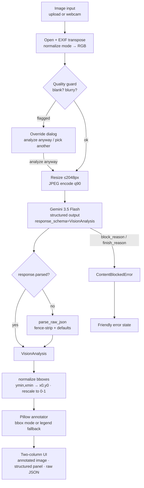

# Architecture

OpenClaw Vision Agent is a single-process Streamlit app wrapped around one
multimodal LLM call. The design goal for Week 1 was a tight, legible pipeline:
one straight line from an uploaded image to a structured, annotated safety read,
with every failure mode handled before it reaches the user.

## Pipeline

## Component responsibilities

| Module | File | Role |
|--------|------|------|
| Vision | `core/vision.py` | Pydantic schema (`VisionAnalysis`, `DetectedObject`), image preprocessing, system prompt, Gemini structured-output call, content/safety block detection, bbox normalization. |
| Parser | `core/parser.py` | Fallback when the SDK can't hand back a parsed object — strips markdown fences, parses JSON, fills missing fields with defaults; `safe_to_dict` for clean display. |
| Annotator | `core/annotator.py` | Draws findings on an RGBA copy via an alpha-composited overlay. Bbox mode (clamped rectangles + collision-aware labels) or, when no usable boxes exist, a numbered legend panel. |
| Quality | `core/quality.py` | Pre-call heuristics that flag blank (flat-frame std) or blurry (Laplacian variance) images so the UI can warn before spending a Gemini call. |
| App | `app.py` | Streamlit UI: input source toggle, validation, the override dialog, spinner, session-state persistence, two-column results, and the full error matrix. |

`core/quality.py` is an Iteration-3 addition beyond the original PRD's
`Project Structure` — it earns its place by catching unusable images cheaply and
locally instead of paying for a model round-trip that has nothing to analyze.

## Why each choice

**Gemini 3.5 Flash over the assignment's suggested `gpt-4o`.** Flash has a
generous free tier (this is an unfunded take-home), native spatial grounding so
bounding boxes come back without a separate detector, and first-class structured
outputs — passing the Pydantic class as `response_schema` guarantees schema-valid
JSON. The tradeoff: boxes are model estimates, not a calibrated detector like
YOLO. Accepted for a Week-1 prototype, and documented honestly in the README.

**Streamlit over Flask/FastAPI + a frontend.** The deliverable is a demo, not a
service. Streamlit gives file upload, `st.camera_input`, two-column layout, and a
modal dialog out of the box, so effort went into the vision pipeline rather than
plumbing. The tradeoff — Streamlit's rerun model — is handled by persisting
results in `st.session_state` so they survive reruns and don't flicker.

**Pillow over OpenCV.** Annotation here is rectangles, text, and a legend panel.
Pillow does that with alpha compositing and no heavy native dependency; OpenCV
would add install weight for capabilities this app never uses.

**Pydantic structured outputs over hand-rolled JSON prompting.** The schema is
the contract: the model is constrained to it, and `app.py` consumes a typed
object instead of guessing at dict keys. `parser.py` exists as a safety net for
the rare case the SDK returns raw text — defense in depth, not the primary path.
