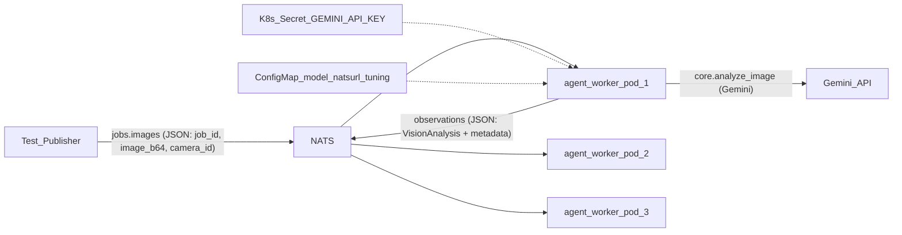

# Week 1: Infrastructure Foundation

**Status:** Complete.

Implement Week 1 of the [multi-agent surveillance plan](../multi-agent-visual-intelligence-5-week-plan.md): a headless NATS-driven agent worker wrapping the existing `core/` pipeline, containerized and deployed as 3 replicas on a local k3d cluster with NATS, Secret, ConfigMap, and health probes.

Assumes virtualization is enabled and Docker Desktop is installed. See [week1-setup.md](week1-setup.md) for step-by-step reproduction on a fresh machine.

## Architecture

## New files

### 1. `agent/` package (reuses `core/` unchanged)

- [agent/config.py](../agent/config.py) — settings from env vars only: `NATS_URL`, `GEMINI_API_KEY`, `MODEL_NAME`, `JOBS_SUBJECT` (default `jobs.images`), `OBS_SUBJECT` (default `observations`), `MAX_IMAGE_SIZE`, `HEALTH_PORT`.
- [agent/messages.py](../agent/messages.py) — Pydantic wire models: `ImageJob` (`job_id`, `camera_id`, `image_b64`, `timestamp`) and `Observation` (`job_id`, `camera_id`, `worker_id`, `timestamp`, embedded `VisionAnalysis` fields, `error` field for failures). This is the v0 seed of the Week 2 observation schema.
- [agent/worker.py](../agent/worker.py) — asyncio main loop:
  - connect to NATS (`nats-py`), subscribe to `jobs.images` with a queue group (`workers`) so replicas load-balance,
  - per message: decode → `core.analyze_image()` (run in thread executor since it's blocking) → publish `Observation` JSON to `observations`; publish an error observation on failure rather than crashing,
  - graceful shutdown on SIGTERM.
- [agent/health.py](../agent/health.py) — tiny stdlib HTTP server: `GET /healthz` (liveness: process alive) and `GET /readyz` (readiness: NATS connection `is_connected`).
- [agent/publish_test_job.py](../agent/publish_test_job.py) — dev script: read an image file, base64, publish to `jobs.images`, subscribe and print the observation (used for acceptance testing).

### 2. Container

- [Dockerfile](../Dockerfile) — `python:3.12-slim`, install `requirements-agent.txt` (subset: `google-genai`, `Pillow`, `pydantic`, `nats-py` — no Streamlit), copy `core/` + `agent/`, non-root user, `CMD ["python", "-m", "agent.worker"]`.
- [requirements-agent.txt](../requirements-agent.txt) — slim runtime deps; `nats-py` also in dev `requirements.txt`.
- [.dockerignore](../.dockerignore)

### 3. Kubernetes manifests (`k8s/`)

- [k8s/namespace.yaml](../k8s/namespace.yaml) — `surveillance` namespace.
- [k8s/secret.yaml.example](../k8s/secret.yaml.example) — template for `GEMINI_API_KEY` (real secret created via `kubectl create secret`, never committed).
- [k8s/configmap.yaml](../k8s/configmap.yaml) — `MODEL_NAME`, `NATS_URL=nats://nats.surveillance.svc:4222`, subjects, max image size.
- [k8s/agent-deployment.yaml](../k8s/agent-deployment.yaml) — `replicas: 3`, image from k3d registry (`k3d-registry.localhost:5000/vision-agent:dev`), `envFrom` ConfigMap + Secret, `livenessProbe: /healthz`, `readinessProbe: /readyz`, modest resource requests/limits.

### 4. Cluster setup scripts (`scripts/`)

PowerShell scripts so the workflow is reproducible:

- [scripts/setup-cluster.ps1](../scripts/setup-cluster.ps1) — `k3d registry create` + `k3d cluster create surveillance --registry-use ...`; `helm repo add nats` and `helm install nats nats/nats -n surveillance`.
- [scripts/build-and-deploy.ps1](../scripts/build-and-deploy.ps1) — create Secret from `.env`, `docker build` → push to k3d registry → `kubectl apply -f k8s/` → rollout restart.

### 5. Tests

- [tests/test_messages.py](../tests/test_messages.py) — wire-schema round-trip and validation-rejection tests.
- [tests/test_worker.py](../tests/test_worker.py) — worker message handler with mocked NATS client and mocked `analyze_image` (success path, analysis-failure path → error observation). No live API.

## Execution order

1. Install CLIs (Docker, k3d, kubectl, helm, nats CLI); verify Docker works.
2. Write `agent/` package + tests; run pytest (49 tests, including 41 original).
3. Write Dockerfile; local `docker build` + smoke-run against NATS in a container.
4. Create k3d cluster + registry, install NATS via Helm.
5. Create Secret from `.env` key, apply ConfigMap + Deployment.
6. Acceptance check: `kubectl get pods` all Running/Ready; `agent/publish_test_job.py` (port-forwarded NATS) publishes a sample image to `jobs.images` and receives a structured observation on `observations`; grep manifests/image to confirm key only comes from the Secret.

## Acceptance criteria

- `kubectl get pods` → all agent pods `Running`, probes passing
- Publishing a test message to `jobs.images` results in an observation on `observations` (verify with `nats sub` CLI or `agent/publish_test_job.py`)
- `grep` of image/manifests confirms the API key comes only from the Secret

## Notes

- `core/vision.py` reads `MODEL_NAME` env var with `gemini-3.5-flash` as default (minimal, backward-compatible touch to `core/`).
- Streamlit app remains untouched and working.
- Week 1 does **not** change desk-safety mode to area surveillance; that is planned for Week 2+.
