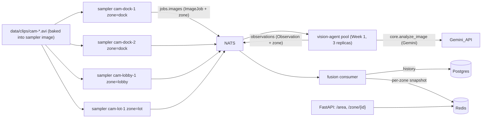

# Week 2: Observations & Zone-Level Fusion (Version A)

**Status:** Complete and verified live on the k3d cluster.

Implements Week 2 of the [multi-agent surveillance plan](../multi-agent-visual-intelligence-5-week-plan.md): a shared observation schema with a `zone`, per-camera frame **samplers** that feed the existing worker pool, and a **fusion service** that persists observation history to Postgres, maintains a live per-zone snapshot in Redis, and serves a fused area summary over a FastAPI read API.

This document is written so it can be fed directly into the Week 3 session. It covers what exists now, how it expanded on Week 1, how to run/verify it, and the current paused state of the cluster.

---

## How this builds on Week 1

Week 1 delivered a headless worker pool: a single `jobs.images` NATS subject, 3 `vision-agent` replicas load-balanced via a queue group, each calling `core.analyze_image` (Gemini) and publishing an `Observation` to `observations`. There was **no producer, no storage, no zones, and no read API** — and the vision prompt was still in "Desk Safety Assistant" mode.

Week 2 keeps that worker pool **completely unchanged on the publish path** and adds producers in front of it and a consumer behind it:

| Concern | Week 1 | Week 2 addition |
|---|---|---|
| Frame source | manual test publisher | `sampler/` — one Deployment per camera, samples a clip and publishes `ImageJob`s |
| Wire schema | `ImageJob` / `Observation` (no zone), `SCHEMA_VERSION=0.1` | added `zone`; bumped to `SCHEMA_VERSION=0.2` |
| Vision prompt | desk-safety framing | area-surveillance framing, env-overridable, per-zone context injected |
| Persistence | none | Postgres history (`fusion/db.py`) |
| Live state | none | Redis per-zone snapshot (`fusion/store.py`) |
| Query surface | none | FastAPI read API: `GET /area`, `/zone/{id}`, `/zones`, `/healthz` |
| Consumer | none | `fusion/consumer.py` subscribes to `observations`, validates, persists, snapshots |

The agent worker, ConfigMap subjects, and NATS topology from Week 1 were reused as-is; the only change to `agent/` was threading `zone` through the schema and into `analyze_image`.

---

## Architecture



Data flow for one frame: sampler grabs a frame → `ImageJob` (base64 JPEG + `camera_id` + `zone`) on `jobs.images` → worker runs `analyze_image(bytes, zone)` → `Observation` on `observations` → fusion validates, writes a Postgres row, and overwrites the latest snapshot for that camera in Redis → `GET /area` fuses the latest-per-camera snapshots into a per-zone summary.

---

## Changed files (expanding Week 1)

### Scene-processing prompt — [core/vision.py](../core/vision.py)
- Rewrote `SYSTEM_PROMPT` (now `DEFAULT_SYSTEM_PROMPT`, with a backward-compatible `SYSTEM_PROMPT` alias) from desk-safety to **area-surveillance** framing: identify people/vehicles/equipment, describe area activity, flag safety/security risks (spills, blocked exits/walkways, restricted-area presence, unattended objects, unsafe vehicle/pedestrian proximity).
- Made it **env-overridable**: `analyze_image` reads `os.getenv("SYSTEM_PROMPT", DEFAULT_SYSTEM_PROMPT)` via `_resolve_system_prompt(zone)`, so a deployment can override the prompt without a rebuild.
- **Per-zone context injection**: signature is now `analyze_image(image_bytes: bytes, zone: str | None = None)`. When `zone` is set, a short line ("You are observing the '{zone}' area; ...") is appended to the system instruction. Output schema (`VisionAnalysis`) is unchanged. The Streamlit `app.py` call (`analyze_image(image_bytes)`) still works.

### Shared schema — [agent/messages.py](../agent/messages.py)
- `SCHEMA_VERSION = "0.2"`.
- Added `zone: str = "unknown"` to both `ImageJob` and `Observation` (default preserves backward compatibility). `Observation` still embeds the full `VisionAnalysis` (objects with `bbox`/`confidence`, risks, suggested actions) rather than flattening it.

### Worker — [agent/worker.py](../agent/worker.py)
- `handle_job` copies `job.zone` onto success and error observations (malformed → `zone="unknown"`) and passes `zone=job.zone` into `analyze_image`.

### ConfigMap — [k8s/configmap.yaml](../k8s/configmap.yaml)
- Added `DATABASE_URL` (no password — injected separately), `REDIS_URL`, `SAMPLE_INTERVAL_SECONDS=5`.

### Deploy script — [scripts/build-and-deploy.ps1](../scripts/build-and-deploy.ps1)
- Now also: reads `POSTGRES_PASSWORD` from `.env` (default `postgres`) and creates the `postgres-credentials` Secret; fetches clips if missing; builds/pushes `vision-sampler:dev` and `vision-fusion:dev`; applies the new manifests; waits for postgres/redis/agent/fusion rollouts.

---

## New files

### Sampler — [sampler/](../sampler/) (one process per camera)
- [sampler/config.py](../sampler/config.py) — env: `NATS_URL`, `JOBS_SUBJECT`, `CAMERA_ID`, `ZONE`, `CLIP_PATH`, `SAMPLE_INTERVAL_SECONDS` (default 5), `LOOP` (default true), `MAX_IMAGE_SIZE` (default 1280).
- [sampler/frames.py](../sampler/frames.py) — OpenCV: opens the clip, samples 1 frame every `round(fps * interval)` frames (≈ one frame per `interval` seconds of clip time), JPEG-encodes (downscaled to `MAX_IMAGE_SIZE` longest edge, quality 90), and loops back to the start on EOF.
- [sampler/main.py](../sampler/main.py) — asyncio: connect NATS, build `ImageJob(uuid, camera_id, zone, base64 jpeg)`, publish to `jobs.images`, sleep `interval` (wall clock), graceful SIGINT/SIGTERM shutdown.

### Fusion service — [fusion/](../fusion/) (single process: consumer + API)
- [fusion/config.py](../fusion/config.py) — env: `DATABASE_URL`, `DB_PASSWORD` (separate so the password stays in a Secret, not the ConfigMap), `REDIS_URL`, `NATS_URL`, `OBS_SUBJECT`, `API_HOST`/`API_PORT`.
- [fusion/db.py](../fusion/db.py) — `asyncpg` pool; idempotent `CREATE TABLE IF NOT EXISTS observations (...)` on startup (columns: `job_id, camera_id, zone, worker_id, ts, scene_summary, objects jsonb, risks jsonb, suggested_actions jsonb, confidence_notes, schema_version, error, created_at`; indexes on `zone` and `ts`); `insert_observation(obs)`; `count(zone=None)`.
- [fusion/store.py](../fusion/store.py) — `redis.asyncio` client; `update_snapshot` writes the latest observation per camera into hash `zone:{zone}` (field = `camera_id`) and adds the zone to a `zones` set; `summarize_zone` fuses cameras into `{camera_count, cameras, object_counts, risks, last_updated, summary}`; `get_zone`, `get_area`, `list_zones`. `Store.from_client` exists for tests.
- [fusion/consumer.py](../fusion/consumer.py) — `process(db, store, raw)` validates with `Observation.model_validate_json` (malformed → logged + dropped = schema-validation gate), then `insert_observation` + `update_snapshot`. `Consumer` wraps the NATS subscription.
- [fusion/api.py](../fusion/api.py) — FastAPI on a `router` that depends on `get_store` (so tests mount it with a fake store and skip the connecting lifespan). Routes: `GET /area`, `GET /zone/{id}` (404 on unknown zone), `GET /zones`, `GET /healthz`. The `lifespan` opens the asyncpg pool + redis client, ensures schema, connects NATS, and starts the consumer task.

### Containers & deps
- [Dockerfile.sampler](../Dockerfile.sampler) — `python:3.12-slim` + `libgl1`/`libglib2.0-0` (OpenCV runtime libs) + [requirements-sampler.txt](../requirements-sampler.txt); copies `core/`, `agent/`, `sampler/`, `data/clips/`.
- [Dockerfile.fusion](../Dockerfile.fusion) — `python:3.12-slim` + [requirements-fusion.txt](../requirements-fusion.txt); copies `core/`, `agent/`, `fusion/`; runs `uvicorn fusion.api:app`.
- Note: both new images install `google-genai` + `Pillow` because the shared `agent.messages` imports `core.vision` (for `VisionAnalysis`) at load time.

### Kubernetes manifests (`k8s/`)
- [k8s/postgres.yaml](../k8s/postgres.yaml) — `postgres:16` Deployment (`Recreate` strategy) + Service `postgres:5432` + 1Gi PVC; password from the `postgres-credentials` Secret; `pg_isready` probes.
- [k8s/redis.yaml](../k8s/redis.yaml) — `redis:7-alpine` Deployment + Service `redis:6379`; `redis-cli ping` probes. **In-memory — not persisted.**
- [k8s/fusion-deployment.yaml](../k8s/fusion-deployment.yaml) — Deployment + Service `fusion:8000`; `envFrom` the ConfigMap; `DB_PASSWORD` injected from the Secret; `/healthz` probes.
- [k8s/sampler-deployment.yaml](../k8s/sampler-deployment.yaml) — **4 Deployments**: `cam-dock-1` and `cam-dock-2` both `zone=dock` (demonstrates multi-camera-into-one-zone fusion), `cam-lobby-1` `zone=lobby`, `cam-lot-1` `zone=lot`. Each sets `CAMERA_ID`, `ZONE`, `CLIP_PATH`.
- [k8s/postgres-secret.yaml.example](../k8s/postgres-secret.yaml.example) — template for `POSTGRES_PASSWORD`.

### Scripts
- [scripts/fetch-sample-clips.ps1](../scripts/fetch-sample-clips.ps1) — downloads OpenCV's BSD-licensed `vtest.avi` (guaranteed) plus a best-effort second clip, and materializes one `data/clips/cam-*.avi` per camera. Clips are gitignored; drop your own footage in `data/clips/` to replace any camera.

### Tests (`tests/`) — 73 passing (was 41 in Week 1)
- [tests/test_vision.py](../tests/test_vision.py) — `SYSTEM_PROMPT` env override + `analyze_image(zone=...)` injection (genai client mocked).
- [tests/test_messages.py](../tests/test_messages.py) — `zone` round-trip/default, `SCHEMA_VERSION == 0.2`.
- [tests/test_worker.py](../tests/test_worker.py) — `zone` propagates to success/error observations; `analyze_image` called with `zone`.
- [tests/test_sampler.py](../tests/test_sampler.py) — frame cadence/loop (mocked `cv2.VideoCapture`); `ImageJob` built with correct `camera_id`/`zone`.
- [tests/test_fusion_store.py](../tests/test_fusion_store.py) — per-zone aggregation, latest-per-camera overwrite (fakeredis).
- [tests/test_fusion_consumer.py](../tests/test_fusion_consumer.py) — valid → persist + snapshot; malformed → rejected.
- [tests/test_fusion_api.py](../tests/test_fusion_api.py) — `/area`, `/zone/{id}`, 404, `/healthz` (mocked store).
- [tests/test_e2e_fusion.py](../tests/test_e2e_fusion.py) — end-to-end: raw observation bytes → consumer → Redis fusion → `GET /area`, plus malformed rejection.

---

## How a video is analyzed (key behavior for Week 3)

- It is **frame sampling, not video analysis.** Each clip is reduced to still JPEGs; the model never sees motion or two frames together.
- `SAMPLE_INTERVAL_SECONDS` (default **5**) controls both the clip-time spacing of sampled frames and the wall-clock publish rate (≈ 1 frame / 5s / camera ≈ 12/min/camera).
- **Each frame = one Gemini call** and is analyzed **statelessly**. There is no tracking, no temporal reasoning, and no cross-camera identity — object counts are per-frame. (Cross-camera re-ID is Week 4.)
- The real throughput limit is the **3-worker pool** (~9s per Gemini call ⇒ ~20 frames/min total); excess buffers in NATS, and since core NATS is **not durable**, a NATS restart drops the buffer.
- Fusion is **latest-wins per camera** in Redis, so `GET /area` reflects the freshest frame from each feed (not an average over time). Full history is in Postgres.

---

## Reproduce / run

```powershell
# 1. One-time cluster + NATS (idempotent)
scripts/setup-cluster.ps1

# 2. Build all images, create secrets, fetch clips, deploy everything
scripts/build-and-deploy.ps1
```

Known k3d-on-Windows gotcha: the kubeconfig server may be written as `host.docker.internal` and resolve to a LAN IP, making the API unreachable. Fix by pointing it at localhost (port from `docker port k3d-surveillance-serverlb`):

```powershell
kubectl config set-cluster k3d-surveillance --server=https://127.0.0.1:PORT
```

View the live fused summary:

```powershell
kubectl -n surveillance port-forward svc/fusion 8000:8000
# then: http://localhost:8000/area  and  http://localhost:8000/zone/dock
```

Browse history directly in Postgres:

```powershell
kubectl -n surveillance exec deploy/postgres -- env PGPASSWORD=postgres `
  psql -U postgres -d surveillance -c "SELECT camera_id, zone, scene_summary, risks FROM observations ORDER BY ts DESC LIMIT 5;"
```

---

## Acceptance results (verified live)

- **Observations land in Postgres:** confirmed; the demo run produced **155 observations** (all successful, 0 errors): `dock=78, lobby=38, lot=39`. Dock fuses 2 cameras.
- **`GET /area` returns a fused per-zone summary** that updates as samplers report, e.g. `dock: 2 cameras, 3 pedestrian, 1 white van, ...; risks: ...roadway...`. `/zone/dock` works; `/zone/<unknown>` → 404. The surveillance prompt is clearly active (pedestrians, vans, tripods, "Fire assembly point" sign, litter/tripping hazards).
- **Malformed observations are rejected:** publishing garbage to `observations` produced `WARNING fusion.consumer Rejected malformed observation` and was not persisted.

Note: all four demo cameras currently point at the same OpenCV pedestrian sample footage (two shared clips), so scenes look similar — the demo exercises the fusion *mechanics*, not distinct locations. Replace `data/clips/cam-*.avi` with real per-camera footage for visually distinct zones.

---

## IMPORTANT — current cluster state (paused to prevent API calls)

The samplers have been **scaled to 0 replicas** to stop all Gemini API calls while the cluster sits idle:

```powershell
kubectl -n surveillance scale deploy -l app=sampler --replicas=0
```

Because `replicas: 0` is stored desired state, this **persists across Docker/cluster restarts** — no samplers run, no frames are published, no API calls are made. The workers and fusion service stay up but idle. The Postgres history (155 rows) survives restarts on its PVC; the Redis live snapshot is in-memory and is cleared on restart (so `GET /area` is empty until samplers run again).

**To revert to the normal running state (this resumes Gemini API calls / cost):**

```powershell
kubectl -n surveillance scale deploy -l app=sampler --replicas=1
```

The only other thing that would flip samplers back on is re-running `scripts/build-and-deploy.ps1`, which re-applies the manifests' `replicas: 1`.

---

## Suggested starting points for Week 3

Week 3 is "Multi-Feed Demo & Reliability" (see the [5-week plan](../multi-agent-visual-intelligence-5-week-plan.md)). Natural next steps given the current code:

- **Scale to 5-10 feeds:** add more sampler Deployments (and ideally distinct clips per camera); consider parameterizing samplers instead of one hand-written Deployment block each.
- **Reliability:** add retries / dead-letter handling for failed `analyze_image` calls and Gemini rate limits; the worker currently publishes an error `Observation` on failure but does not retry. Consider NATS JetStream if at-least-once delivery / durability is needed (core NATS currently drops buffered jobs on restart).
- **Monitoring:** install Prometheus + Grafana; dashboard observation throughput, error rate, per-agent liveness, end-to-end latency. The fusion consumer and worker are the natural metric emitters.
- **Demo surface:** there is no web UI yet — only the JSON API + Postgres. A small dashboard reading `GET /area` would make a convincing "single screen of area awareness."
- **Throughput:** the 3-worker pool caps at ~20 frames/min; bumping `vision-agent` replicas and watching the API rate-limit/cost ceiling is the documented Week 3 stretch.
```
