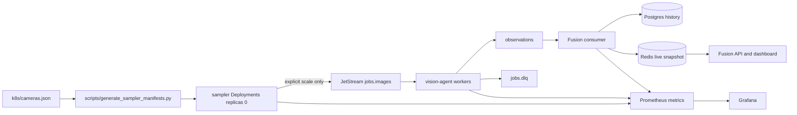

# Week 3: Multi-Feed Demo & Reliability

**Status:** Implemented in code; live 1-hour acceptance run is intentionally not executed until sampler scale-up is explicitly approved.

Week 3 turns the Week 2 plumbing into a safer, more believable, and measurable demo:

- camera feeds are configured as data in `k8s/cameras.json`;
- generated sampler Deployments default to `replicas: 0`;
- Fusion serves a single-screen area-awareness dashboard;
- workers add bounded retries, DLQ records, and JetStream ack/nak handling;
- Prometheus/Grafana metrics can measure throughput, errors, retries, DLQ, and latency.

## Cost Guardrail

Sampler pods publish frames, and every processed frame can trigger a Gemini call. For that reason, the committed sampler state remains off by default:

```powershell
python scripts/generate_sampler_manifests.py
kubectl apply -f k8s/sampler-deployment.yaml
kubectl -n surveillance get deploy -l app=sampler -o custom-columns=NAME:.metadata.name,REPLICAS:.spec.replicas
```

Expected sampler replicas: `0`.

Use this only when a live run is explicitly intended:

```powershell
scripts/scale-samplers.ps1 -Replicas 1
```

Pause immediately after the run:

```powershell
scripts/scale-samplers.ps1 -Replicas 0
```

## Architecture Delta From Week 2



## New And Changed Files

- `k8s/cameras.json` defines the 8 demo cameras.
- `scripts/generate_sampler_manifests.py` generates `k8s/sampler-deployment.yaml`; generated samplers always default to `replicas: 0`.
- `scripts/build-and-deploy.ps1` regenerates sampler manifests, provisions JetStream streams, and does not turn samplers on.
- `scripts/scale-samplers.ps1` is the explicit feed on/off control.
- `dashboard/` contains the static Fusion-served dashboard.
- `agent/retry.py` classifies retryable vs terminal worker failures.
- `agent/messages.py` is schema `0.3`, adding `job_published_at` and `DeadLetterJob`.
- `k8s/nats-values.yaml` enables JetStream, and `k8s/jetstream-setup-job.yaml` creates `JOBS` and `JOBS_DLQ`.
- `scripts/setup-monitoring.ps1` installs Prometheus/Grafana.
- `docs/monitoring/week3-grafana-dashboard.json` is the starter Grafana dashboard.
- `scripts/measure_delivery_rate.py` computes acceptance rates from observed counts.

## Dashboard

Fusion serves both JSON and the single-screen dashboard:

```powershell
kubectl -n surveillance port-forward svc/fusion 8000:8000
```

Open:

- `http://localhost:8000/` for the dashboard;
- `http://localhost:8000/area` for the dashboard API payload;
- `http://localhost:8000/metrics` for Fusion Prometheus metrics.

While samplers are at `0`, the dashboard may be empty after Redis restarts. That is expected and confirms no frames are being published.

## Reliability Behavior

Worker behavior is now:

- success: publish a normal `Observation`;
- retryable failure: retry locally with bounded backoff;
- terminal or exhausted failure: publish an error `Observation` and a `DeadLetterJob` to `jobs.dlq`;
- JetStream mode: ack after handled success/error/DLQ work, nak only if processing fails before completion.

JetStream currently protects `jobs.images` and `jobs.dlq`. The `observations` subject remains core NATS for Week 3 scope discipline; Postgres remains the durable history once Fusion receives an observation.

## Monitoring

Install monitoring:

```powershell
scripts/setup-monitoring.ps1
```

Access Grafana:

```powershell
kubectl -n monitoring port-forward svc/monitoring-grafana 3000:80
```

Import `docs/monitoring/week3-grafana-dashboard.json`.

Key metrics:

- `vision_sampler_jobs_published_total`
- `vision_jobs_processed_total`
- `vision_jobs_retried_total`
- `vision_dlq_messages_total`
- `vision_analyze_duration_seconds`
- `vision_observations_fused_total`
- `vision_observations_rejected_total`

## Dry-Run Delivery Report

Without starting samplers, validate the report math:

```powershell
python scripts/measure_delivery_rate.py --feeds 8 --processed 0 --succeeded 0 --failed 0 --duration-seconds 3600
```

For a real run, replace counts with observed Prometheus/Postgres numbers:

```powershell
python scripts/measure_delivery_rate.py --published 5760 --processed 5600 --succeeded 5500 --failed 100 --dlq 25
```

## Live Stability Run Procedure

Do not run this unless Gemini API cost is explicitly approved.

1. Confirm samplers are off:

   ```powershell
   kubectl -n surveillance get deploy -l app=sampler -o custom-columns=NAME:.metadata.name,REPLICAS:.spec.replicas
   ```

2. Start monitoring and Fusion port-forwarding.

3. Explicitly enable feeds:

   ```powershell
   scripts/scale-samplers.ps1 -Replicas 1
   ```

4. Run for the chosen window, for example 1 hour.

5. Record published, processed, success, failure, retry, and DLQ counts from Grafana/Prometheus/Postgres.

6. Pause feeds:

   ```powershell
   scripts/scale-samplers.ps1 -Replicas 0
   ```

7. Generate the delivery report and paste results here.

## Verification

Default no-cost verification:

```powershell
python -m pytest -v
python scripts/generate_sampler_manifests.py
kubectl -n surveillance get deploy -l app=sampler -o custom-columns=NAME:.metadata.name,REPLICAS:.spec.replicas
```

The tests are mock-only by default and do not require live Gemini calls.

## Non-Goals Preserved

- No Week 4 re-identification or entity tracking.
- No temporal smoothing or cross-camera deduplication.
- No automatic worker or sampler scale-up.
- No Redis persistence migration.
